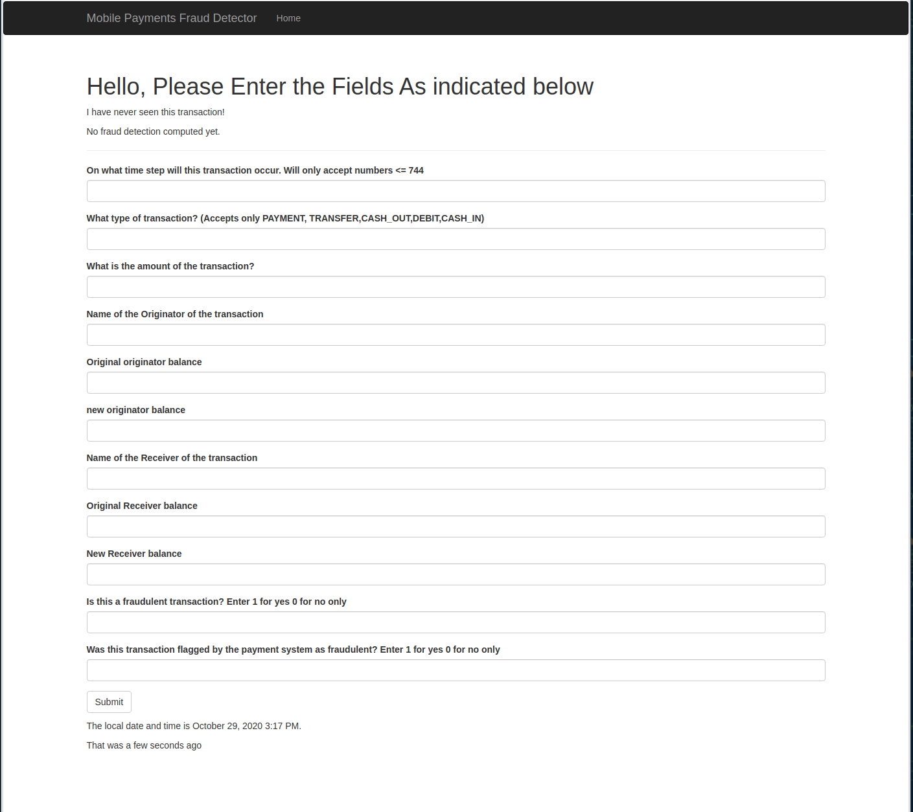

# Automatically Detecting Fraudulent Transactions within a Mobile Payment System

## Description

This project analyzes a simulation of a 31-day hour-by-hour history of mobile transactions
within a SIM-based mobile payments system. This project develops models to
automatically detect fraudulent transactions within the system using
[bagging](https://en.wikipedia.org/wiki/Bootstrap_aggregating) and [gradient boosting](https://en.wikipedia.org/wiki/Bootstrap_aggregating).

More information about the data set can be found here: [Synthetic Financial Datasets for Fraud Detection](https://www.kaggle.com/ntnu-testimon/paysim1).

## Features and Targets Variables

The dependent variable in the model is `isFraud` variable which indicates
whether the transaction is truly fraudulent (if it's a 1) or not (if it's a 0).

These features were used in the final models:

* `step`: Point in time when the transaction occured
* `transtype`: A categorical feature that can take on the values CASH-IN, CASH-OUT, DEBIT, PAYMENT, or TRANSFER
* `amount`: Floating point number representing the amount of the transaction.
* `oldbalance`: Initial amount in the transaction originator's account before transaction has completed
* `newbalanceOrig`: Final amount in the transaction originator's account after transaction has completed
* `oldbalanceDest`: Initial amount in the transaction receiver's account before transaction has completed
* `newblanaceDest`: Final amount in the transaction receiver's account after transaction has
  completed
  
The model predicts `isFraud`, which is 1, when the transaction is fraudulent,
and 0 when it is not.

## Data Used

The data set is composed of 6,354,408 non-fraudulent transactions and 8,213
fraudulent transactions.

## Tools Used

* [Kaggle](https://www.kaggle.com/ntnu-testimon/paysim1): The data set.
* [pymysql](https://pandas.pydata.org/): python module used to enable the jupyter notebook to send SQL queries to
  the remote SQL server.
* mariaDB: Data was stored within a self-hosted SQL database using [mariaDB](https://en.wikipedia.org/wiki/Bootstrap_aggregating)
* [pandas](https://acrobat.adobe.com/us/en/acrobat/pdf-reader.html): for [EDA]() and preparation of the training and test data
* [numpy](https://pandas.pydata.org/): for [EDA]()  and preparation of the training and test data
* [sklearn](https://en.wikipedia.org/wiki/Bootstrap_aggregating): Used it for generating train and test datasets scoring, and model evaluation
* [XGBoost](http://www.xgboost.com/) : Used as one of the final models
* [rapids](https://rapids.ai/index.html): Used it for the logistic model and random forest model which enabled
  accelerating training of these models. This enabled faster model testing and
  evaluation iterations.
* [matpolotlib](https://rapids.ai/index.html), and [seaborn](https://seaborn.pydata.org/): For visualization of the data set and model
  metrics evaluation
* [flask](https://seaborn.pydata.org/): Used this to build a fraudulent mobile payments detector.
* emacs
* [Microsoft Powerpoint](https://www.microsoft.com/en-us/microsoft-365/powerpoint)
* [Acrobat](https://www.microsoft.com/en-us/microsoft-365/powerpoint)


The complete list of modules used is in the requirements files: `Source/conda_requirements.yml`

## Description of Files


* `Source/Project3_Final.ipynb`: The jupyter notebook that contains the web
scrapping software,
[EDA](https://en.wikipedia.org/wiki/Exploratory_data_analysis), model selection, and final model testing and evaluation code.
* `Documents/Linke_to_Presentation.md`: Markdown file that has a link to the presentation.
* `Source/web_app/project3.py`: Main flask application code
* `Source/web_app/migrations/*`: Files used to use [alembic]() to version the
  database used by the web application
* `Source/web_app/static/favicon.ico`: favicon for the flask web application
* `Source/web_app/templates/404.html`: HTML template to serve as reponse to
  404 errors
* `Source/web_app/templates/500.html`: HTML template to serve as reponse to
  500 errors
* `index.html`: Template for the `/` route
* `mail/new_transaction.html` template used by the web server to formulate
  email notifications for when a user enters a new transaction
* `mail/new_transaction.html` template used by the web server to formulate
  email notifications for when a user enters a new transaction in plain text
  form
* `conda_requirements.yml`: YML you can use to recreate the python virtual
  environment I used to develop and run this project

Please note you can ignore everything in the `REPO/Source/.ignore` directory.

## Steps To Reproduce This Project


1. Clone this repo
1. Run this command: `conda env create -f Source/conda_requirements.yml`
1. Once that's done and you have activated your virtual environment you should
   be able to start jupyter lab with this command: `jupyter lab`
1. With Jupyter Lab, open the notebook `Source/Project3_Final.ipynb`
1. You should be able to run the cells. Please note that the default settings
   of the notebook require a pkl file of the cleaned data. Please contact me
   if you want that data. Depending on the option settings in the notebook,
   you can run the cells that upload the CSV file to a SQL server, clean the
   data on the SQL server, and import the data into a pandas dataframe in the
   notebook. If you want to do that you will (1) have to download the CSV
   dataset from Kaggle, and (2) contact me to obtain credentials to access the
   SQL server.
   
This project was developed and tested on a Linux machine. I used a Linux
distribution with the following properties:

```
LSB Version:	core-2.0-noarch:core-3.2-noarch:core-4.0-noarch:core-2.0-x86_64:core-3.2-x86_64:core-4.0-x86_64:desktop-4.0.fake-amd64:desktop-4.0.fake-noarch:graphics-2.0-amd64:graphics-2.0-noarch:graphics-3.2-amd64:graphics-3.2-noarch:graphics-4.0.fake-amd64:graphics-4.0.fake-noarch
Distributor ID:	openSUSE
Description:	openSUSE Tumbleweed
Release:	20200128
Codename:	n/a
```

```
Linux _REDACTED_ 5.4.14-1-default #1 SMP Thu Jan 23 08:54:47 UTC 2020 (fc4ea7a) x86_64 x86_64 x86_64 GNU/Linux

```

### The Web Application

Running the web application will required the following:

* A setup script to set the application configuration variables that contain
  the credentials to enable the web application to access the remote SQL
  database and to send emails to the admin of the web application. You can
  ask me for a copy of the setup script.
  
Once you have obtained the the setup script you can run the following commands
to launch the web application

1. `cd Source/web_application`
1. `source <setup_script>`
1. `flask run`

#### How to use the web application

The interface looks like this:



The fields to enter I estimate are likely self explanatory. If you would like
to see a demo you can download a video here: [fraud_detection\_web\_app\_demo.mp4](https://www.dropbox.com/s/1qz0a5p72kx2vun/fraud_detection_web_app_demo.mp4?dl=0)

**Salient But Not Obvious Features of the Web Application**

* It saves the transactions you enter into the database so that they could be
  used to re-train the model (and hopefully improve it) over time.
* It sends an email notification whenever a new transaction that it has never
  seen before has been entered.
* When you hit the **\[Submit\]** button the web application performs a
  prediction of whether or not the transaction you entered is
  fraudulent. This is highlighted in the demonstration video referenced above


